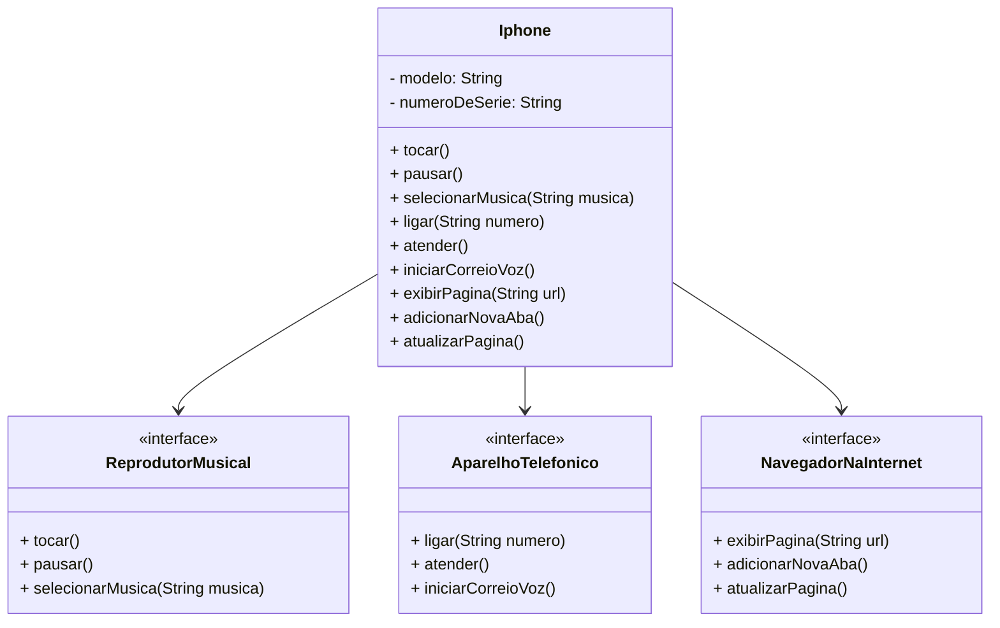

# Desafio - Modelagem e Diagramação de um Componente iPhone

## Diagrama UML do iPhone:

```mermaid
classDiagram
  class Iphone {
    - modelo: String
    - numeroDeSerie: String
    + tocar()
    + pausar()
    + selecionarMusica(String musica)
    + ligar(String numero)
    + atender()
    + iniciarCorreioVoz()
    + exibirPagina(String url)
    + adicionarNovaAba()
    + atualizarPagina()
  }
  class ReprodutorMusical{
    <<interface>>
    + tocar()
    + pausar()
    + selecionarMusica(String musica)
  }
  class AparelhoTelefonico{
    <<interface>>
    + ligar(String numero)          
    + atender()                     
    + iniciarCorreioVoz()
  }
  class NavegadorNaInternet{
    <<interface>>
    + exibirPagina(String url)      
    + adicionarNovaAba()            
    + atualizarPagina() 
  }
  Iphone --> ReprodutorMusical
  Iphone --> AparelhoTelefonico
  Iphone --> NavegadorNaInternet
  
```

